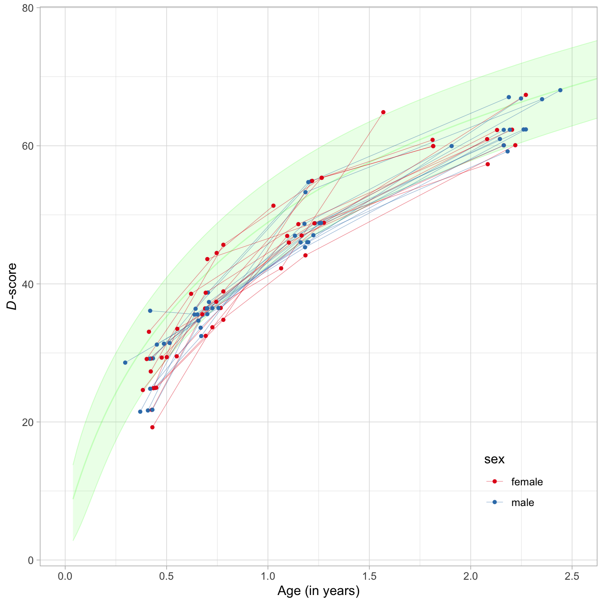

<!-- README.md is generated from README.Rmd. Please edit that file -->

# dscore

<!-- badges: start -->

[](https://www.tidyverse.org/lifecycle/#maturing)
[](https://github.com/stefvanbuuren/dscore/rename)
<!-- badges: end -->

The `dscore` package contains tools to

  - Calculate D-score from item level responses
  - Transform the D-scores into DAZ, age-standardised Z-scores
  - Map your item names to the GSED convention

The required input consists of *item level* responses on milestones from
widely used instruments for measuring child development.

## Installation

You can install the development version from
[GitHub](https://github.com/) with:

``` r
# install.packages("remotes")
remotes::install_github("stefvanbuuren/dscore@rename")
```

## Example

### Inspect the data

The `milestones` dataset in the `dscore` package contain responses of 27
preterm children measured at various age between birth and 2.5 years on
the Dutch Development Instrument (DDI). The dataset looks like:

``` r
library(dscore)
head(milestones[, c(1, 3, 4, 9:15)])
#>    id   age    sex ddigmd053 ddigmd056 ddicmm030 ddifmd002 ddifmd003 ddifmm004 ddicmm031
#> 1 111 0.487   male         1         1         1         1         1         0         1
#> 2 111 0.657   male        NA        NA        NA        NA         1         1         1
#> 3 111 1.180   male        NA        NA        NA        NA        NA        NA        NA
#> 4 111 1.906   male        NA        NA        NA        NA        NA        NA        NA
#> 5 177 0.550 female         1         1         1         1         1         1         1
#> 6 177 0.767 female        NA        NA        NA        NA         1         1         1
```

Each row corresponds to a visit. Most children have three or four
visits. Columns starting with `ddi` hold the responses on DDI-items. A
`1` means a PASS, a `0` means a FAIL, and `NA` means that the item was
not administered.

The `get_labels()` function obtains the labels of the milestones, e.g.,

``` r
items <- names(milestones)[9:15]
labels <- get_labels(items)
print(data.frame(items, labels), right = FALSE, row.names = FALSE)
#>  items     labels                                    
#>  ddigmd053 Smiles in response (M; can ask parents)   
#>  ddigmd056 vocalizes in response                     
#>  ddicmm030 Follows with eyes and head 30d  < 0 > 30d 
#>  ddifmd002 Hands open occasionally                   
#>  ddifmd003 Watches own hands                         
#>  ddifmm004 Moves legs equally well                   
#>  ddicmm031 Lifts chin off table for a moment
```

### Calculate the D-score and DAZ

The `milestones` dataset has properly named columns that identifies each
item. Calculating the D-score and DAZ is then done by:

``` r
ds <- dscore(milestones)
dim(ds)
#> [1] 100   6
```

where `ds` is a `data.frame` with the same number of rows than the input
data. The first six rows are

``` r
head(ds)
#>       a  n     p    d   sem    daz
#> 1 0.487 11 0.909 31.3 1.584 -1.442
#> 2 0.657 14 0.643 34.7 0.981 -2.176
#> 3 1.180 19 0.947 48.7 1.551 -1.191
#> 4 1.906 13 0.846 60.0 1.177 -0.627
#> 5 0.550 11 0.818 29.5 1.334 -2.767
#> 6 0.767 14 0.786 36.5 0.920 -2.533
```

The table below provides the interpretation of each
column:

| Name | Interpretation                                                     |
| ---- | ------------------------------------------------------------------ |
| a    | Decimal age                                                        |
| n    | Number of items used to calculate D-score                          |
| p    | Percentage of passed milestones                                    |
| d    | D-score estimate, mean of posterior                                |
| sem  | Standard error of measurement, standard deviation of the posterior |
| daz  | D-score corrected for age                                          |

### Graphs of D-score and DAZ

The `milestones` data and the result can be combined as

``` r
md <- cbind(milestones, ds)
```

The individual developmental curves of 27 children can be plotted.

``` r
library(ggplot2)
ggplot(md, aes(x = a, y = d, group = id, color = sex)) + 
  xlab("Age (in years)") + 
  ylab("D-score") +
  geom_line(lwd = 0.1) +
  geom_point(size = 1) +
  scale_colour_hue(l = 45) +
  theme_light()
```



The DAZ is an age-standardized D-score with a standard normal
distribution with mean 0 and variance 1. The individual DAZ curves are
plotted as

``` r
ggplot(md, aes(x = a, y = daz, group = id, color = sex)) + 
  theme_light() +
  geom_rect(xmin = 0, xmax = 3, ymin = -2, ymax = 2, 
            fill = "grey97", linetype = 0, show.legend = FALSE) +
  geom_hline(yintercept = -1:1, colour = "white", lwd = 0.5) +
  coord_cartesian(ylim = c(-4, 4)) +
  geom_line(lwd = 0.1) +
  geom_point(size = 1) +
  scale_colour_hue(l = 45) +
  xlab("Age (in years)") +
  ylab("DAZ")
```


Note that the D-scores and DAZ are a little lower than average. The
explanation here is that these all children are born preterm.

### Mapping items names

The `dscore()` function assumes that the item names in your data follow
the GSED naming convention. This convention is a nine-position word that
identifies the instrument, the domain, the administration mode and the
item number. You may decompose an item names into these components, as
follows:

``` r
decompose_itemnames(items)
#>   instrument domain mode number
#> 1        ddi     gm    d    053
#> 2        ddi     gm    d    056
#> 3        ddi     cm    m    030
#> 4        ddi     fm    d    002
#> 5        ddi     fm    d    003
#> 6        ddi     fm    m    004
#> 7        ddi     cm    m    031
```

which gives four components of the seven items.

In practice, you will need to spend some time in renaming your own item
names according to the GSED convention. In order to ease this process,
the `dscore` package offers several functions that can help.

First of all, the measurement instrument in your data needs to be one of
the instruments supported by the `dscore` package. Here’s the table of
instrument names and number of items that are currently defined in the
package:

| Code  | Instrument                                              | Items | dutch | gcdg | gsed |
| ----- | ------------------------------------------------------- | ----: | ----: | ---: | ---: |
| `aqi` | Ages & Stages Questionnaires-3                          |   230 |       |   29 |   17 |
| `bar` | Barrera Moncada                                         |    22 |       |   15 |   13 |
| `bat` | Battelle Development Inventory and Screener-2           |   137 |       |      |      |
| `by1` | Bayley Scales for Infant and Toddler Development-1      |   156 |       |   85 |   76 |
| `by2` | Bayley Scales for Infant and Toddler Development-2      |   121 |       |   16 |   16 |
| `by3` | Bayley Scales for Infant and Toddler Development-3      |   320 |       |  105 |   67 |
| `cro` | Caregiver Reported Early Development Instrument (CREDI) |   149 |       |      |   62 |
| `ddi` | Dutch Development Instrument (Van Wiechenschema)        |    77 |    76 |   65 |   64 |
| `den` | Denver-2                                                |   111 |       |   67 |   50 |
| `dmc` | Developmental Milestones Checklist                      |    66 |       |      |   43 |
| `gri` | Griffiths Mental Development Scales                     |   312 |       |  104 |   93 |
| `iyo` | Infant and Young Child Development (IYCD)               |    90 |       |      |   55 |
| `kdi` | Kilifi Developmental Inventory                          |    69 |       |      |      |
| `mac` | MacArthur Communicative Development Inventory           |     6 |       |    3 |    3 |
| `mds` | WHO Motor Development Milestones                        |     6 |       |      |    1 |
| `mdt` | Malawi Developmental Assessment Tool (MDAT)             |   136 |       |      |  126 |
| `peg` | Pegboard                                                |     2 |       |    1 |    1 |
| `pri` | Project on Child Development Indicators (PRIDI)         |    63 |       |      |      |
| `sbi` | Stanford Binet Intelligence Scales-4/5                  |    33 |       |    6 |    1 |
| `sgr` | Griffiths for South Africa                              |    58 |       |   19 |   19 |
| `tep` | Test de Desarrollo Psicomotor (TEPSI)                   |    61 |       |   33 |   31 |
| `vin` | Vineland Social Maturity Scale                          |    50 |       |   17 |   17 |
| `hyp` | \[special codes, hypothetical instrument\]              |     5 |       |      |      |
|       |                                                         |  2280 |    76 |  565 |  807 |

If your instrument is not here, you cannot calculate the D-score. But
even if your instrument is in the table, there is no garantee that it
can be used for the D-score. Instruments are tied to the D-score by
means of a *measurement model*. The measurement model provides the *key*
for converting the item responses to the D-score.

The `dscore` package currently support three keys: `dutch`, `gcdg` and
`gsed`. Although there is much overlap, different keys cover different
instrument. The table below displays the number of items per instrument
under each of the three keys. If the entry is blank, the key does not
cover the instrument.

For some instruments, e.g., for `cro` only one choice is possible (only
key `gsed`). For `gri`, we may choose between `gcdg` and `gsed`. The
actual choice will depend on the goals of your analysis. If you want to
compare to other D-scores calculated under key `gcdg`, or reproduce an
analysis made under key, then pick `gcdg`. If that is not the case, then
`gsed` is the better choice since it account for a wider variety of
comparisons to other instruments. The differences between the D-scores
calculated under different keys are small, but these are not identical.
If you don’t specify `key`, the `dscore()` function will use `key =
"gsed"` for maximum instrument coverage.

The `dscore` package will recognize 2280 item names. Call the
`get_itemnames()` function with any arguments to see them all. If you
want to see all names of a particular instrument and a particul domain,
then use

``` r
# find all item name in mdt (MDAT), domain gm (gross motor)
items <- get_itemnames(instrument = "mdt", domain = "gm")
items
#>  [1] "mdtgmd001" "mdtgmd002" "mdtgmd003" "mdtgmd004" "mdtgmd005" "mdtgmd006" "mdtgmd007" "mdtgmd008" "mdtgmd009" "mdtgmd010"
#> [11] "mdtgmd011" "mdtgmd012" "mdtgmd013" "mdtgmd014" "mdtgmd015" "mdtgmd016" "mdtgmd017" "mdtgmd018" "mdtgmd019" "mdtgmd020"
#> [21] "mdtgmd021" "mdtgmd022" "mdtgmd023" "mdtgmd024" "mdtgmd025" "mdtgmd026" "mdtgmd027" "mdtgmd028" "mdtgmd029" "mdtgmd030"
#> [31] "mdtgmd031" "mdtgmd032" "mdtgmd033" "mdtgmd034"
```

The labels for this set of items can be found by

``` r
head(get_labels(items))
#>                                             mdtgmd001                                             mdtgmd002 
#>                                "Lifts chin off floor"    "Prone (on tummy), can lift head up to 90 degrees" 
#>                                             mdtgmd003                                             mdtgmd004 
#>                "Holds head upright for a few seconds"                       "Pulls to sit with no head lag" 
#>                                             mdtgmd005                                             mdtgmd006 
#>          "Lifts head, shoulders and chest when prone" "Bears weight on legs when held in standing position"
```

Alternatively, use `decompose_itemnames()` to break down the item names
into its components.

Using these functions, it should be relatively easy to map and rename
your item names into the GSED-convention.

## Resources

### Books and reports

1.  [Introduction into the D-score](https://stefvanbuuren.name/dbook1/)
2.  [Inventory of 147 instruments for measuring early child
    development](http://documents.worldbank.org/curated/en/384681513101293811/A-toolkit-for-measuring-early-childhood-development-in-low-and-middle-income-countries):
    Fernald et al. ([2017](#ref-fernald2017))

### Keys

1.  Project with `dutch` key, 0-2 years: van Buuren
    ([2014](#ref-vanbuuren2014))
2.  Project with `gcdg` key: Weber et al. ([2019](#ref-weber2019))
3.  Project with `gsed` key: GSED team (Maureen Black, Kieran Bromley,
    Vanessa Cavallera (lead author), Jorge Cuartas, Tarun Dua
    (corresponding author), Iris Eekhout, Günther Fink, Melissa
    Gladstone, Katelyn Hepworth, Magdalena Janus, Patricia Kariger,
    Gillian Lancaster, Dana McCoy, Gareth McCray, Abbie Raikes, Marta
    Rubio-Codina, Stef van Buuren, Marcus Waldman, Susan Walker and Ann
    Weber) ([2019](#ref-gsedteam2019))

### Methodology

1.  Interval scale: Jacobusse, van Buuren, and Verkerk
    ([2006](#ref-jacobusse2006))
2.  Adaptive testing: Jacobusse and van Buuren
    ([2007](#ref-jacobusse2007))

### Literature

<div id="refs" class="references">

<div id="ref-fernald2017">

Fernald, L.C.H., E. Prado, P. Kariger, and A. Raikes. 2017. “A Toolkit
for Measuring Early Childhood Development in Low and Middle-Income
Countries.”
<http://documents.worldbank.org/curated/en/384681513101293811/A-toolkit-for-measuring-early-childhood-development-in-low-and-middle-income-countries>.

</div>

<div id="ref-gsedteam2019">

GSED team (Maureen Black, Kieran Bromley, Vanessa Cavallera (lead
author), Jorge Cuartas, Tarun Dua (corresponding author), Iris Eekhout,
Günther Fink, Melissa Gladstone, Katelyn Hepworth, Magdalena Janus,
Patricia Kariger, Gillian Lancaster, Dana McCoy, Gareth McCray, Abbie
Raikes, Marta Rubio-Codina, Stef van Buuren, Marcus Waldman, Susan
Walker and Ann Weber). 2019. “The Global Scale for Early Development
(Gsed).” *Early Childhood Matters*.
<https://earlychildhoodmatters.online/2019/the-global-scale-for-early-development-gsed/>.

</div>

<div id="ref-jacobusse2007">

Jacobusse, G., and S. van Buuren. 2007. “Computerized Adaptive Testing
for Measuring Development of Young Children.” *Statistics in Medicine*
26 (13): 2629–38.
<https://stefvanbuuren.name/publication/2007-01-01_jacobusse2007/>.

</div>

<div id="ref-jacobusse2006">

Jacobusse, G., S. van Buuren, and P.H. Verkerk. 2006. “An Interval Scale
for Development of Children Aged 0-2 Years.” *Statistics in Medicine* 25
(13): 2272–83.
<https://stefvanbuuren.name/publication/2006-01-01_jacobusse2006/>.

</div>

<div id="ref-vanbuuren2014">

van Buuren, S. 2014. “Growth Charts of Human Development.” *Statistical
Methods in Medical Research* 23 (4): 346–68.
<https://stefvanbuuren.name/publication/2014-01-01_vanbuuren2014gc/>.

</div>

<div id="ref-weber2019">

Weber, A.M., M. Rubio-Codina, S.P. Walker, S. van Buuren, I. Eekhout, S.
Grantham-McGregor, M.C. Araujo, et al. 2019. “The D-Score: A Metric for
Interpreting the Early Development of Infants and Toddlers Across Global
Settings.” *BMJ Global Health* to appear.

</div>

</div>
