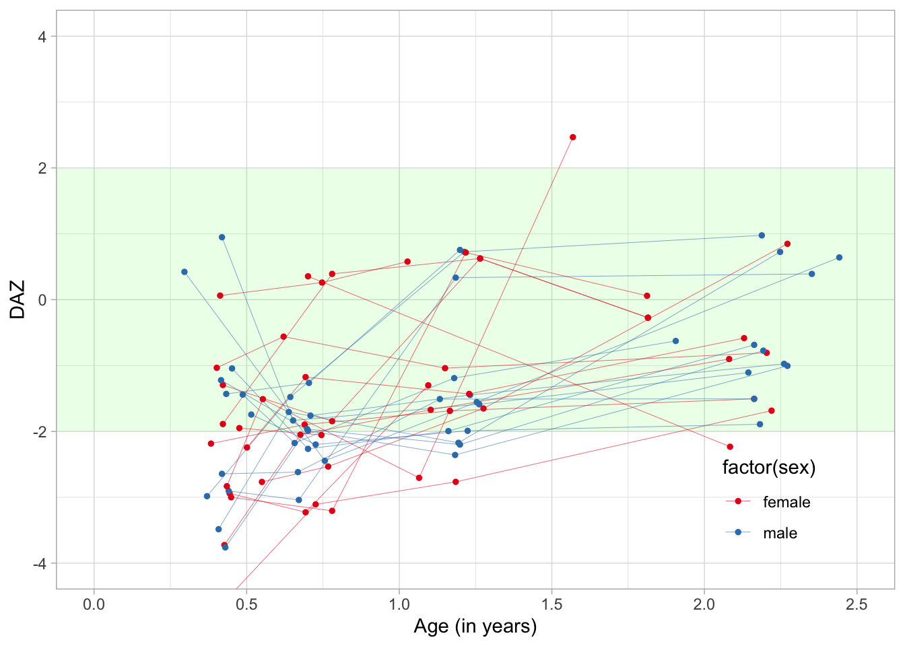

<!-- README.md is generated from README.Rmd. Please edit that file -->

# dscore

<!-- badges: start -->

<!-- badges: end -->

The `dscore` package contains tools to

  - Calculate D-score from item level responses
  - Transform the D-scores into DAZ, age-standardised Z-scores

The required input consists of *item level* responses on milestones from
widely used instruments for measuring child development.

## Installation

You can install the released version of dscore from
[CRAN](https://CRAN.R-project.org) with:

``` r
install.packages("dscore")
```

And the development version from [GitHub](https://github.com/) with:

``` r
# install.packages("remotes")
remotes::install_github("stefvanbuuren/dscore")
```

## Example

### Inspect the data

The `milestones` dataset in the `dscore` package contain responses of 27
preterm children measured at various age between birth and 2.5 years on
the Dutch Development Instrument (DDI). The dataset looks like:

``` r
library(dscore)
head(milestones[, c(1, 3, 4, 9:15)])
#>    id   age    sex ddigmd053 ddigmd056 ddicmm030 ddifmd002 ddifmd003 ddifmm004 ddicmm031
#> 1 111 0.487   male         1         1         1         1         1         0         1
#> 2 111 0.657   male        NA        NA        NA        NA         1         1         1
#> 3 111 1.180   male        NA        NA        NA        NA        NA        NA        NA
#> 4 111 1.906   male        NA        NA        NA        NA        NA        NA        NA
#> 5 177 0.550 female         1         1         1         1         1         1         1
#> 6 177 0.767 female        NA        NA        NA        NA         1         1         1
```

Each row corresponds to a visit. Most children have three or four
visits. Columns starting with `ddi` hold the responses on DDI-items. A
`1` means a PASS, a `0` means a FAIL, and `NA` means that the item was
not administered.

The `get_labels()` function obtains the labels of the milestones, e.g.,

``` r
items <- names(milestones)[9:15]
labels <- get_labels(items)
print(data.frame(items, labels), right = FALSE, row.names = FALSE)
#>  items     labels                                    
#>  ddigmd053 Smiles in response (M; can ask parents)   
#>  ddigmd056 vocalizes in response                     
#>  ddicmm030 Follows with eyes and head 30d  < 0 > 30d 
#>  ddifmd002 Hands open occasionally                   
#>  ddifmd003 Watches own hands                         
#>  ddifmm004 Moves legs equally well                   
#>  ddicmm031 Lifts chin off table for a moment
```

### Calculate the D-score and DAZ

The `milestones` dataset has properly named columns that identifies each
item. Calculating the D-score and DAZ is then done by:

``` r
ds <- dscore(milestones)
dim(ds)
#> [1] 100   6
```

where `ds` is a `data.frame` with the same number of rows than the input
data. The first six rows are

``` r
head(ds)
#>       a  n     p    d   sem    daz
#> 1 0.487 11 0.909 31.3 1.584 -1.442
#> 2 0.657 14 0.643 34.7 0.981 -2.176
#> 3 1.180 19 0.947 48.7 1.551 -1.191
#> 4 1.906 13 0.846 60.0 1.177 -0.627
#> 5 0.550 11 0.818 29.5 1.334 -2.767
#> 6 0.767 14 0.786 36.5 0.920 -2.533
```

The table below provides the interpretation of each
column:

| Name | Interpretation                                                     |
| ---- | ------------------------------------------------------------------ |
| a    | Decimal age                                                        |
| n    | Number of items used to calculate D-score                          |
| p    | Percentage of passed milestones                                    |
| d    | D-score estimate, mean of posterior                                |
| sem  | Standard error of measurement, standard deviation of the posterior |
| daz  | D-score corrected for age                                          |

### Graphs of D-score and DAZ

The `milestones` data and the result can be combined as

``` r
md <- cbind(milestones, ds)
```

The individual developmental curves of 27 children can be plotted.

``` r
library(ggplot2)
ggplot(md, aes(x = a, y = d, group = id, color = sex)) + 
  xlab("Age (in years)") + 
  ylab("D-score") +
  geom_line(lwd = 0.1) +
  geom_point(size = 1) +
  scale_fill_discrete(palette = "Dark2") +
  theme_light()
```


The DAZ is an age-standardized D-score with a standard normal
distribution with mean 0 and variance 1. The individual DAZ curves are
plotted as

``` r
ggplot(md, aes(x = a, y = daz, group = id, color = sex)) + 
  theme_light() +
  geom_rect(xmin = 0, xmax = 3, ymin = -2, ymax = 2, 
            fill = "grey97", linetype = 0, show.legend = FALSE) +
  geom_hline(yintercept = -1:1, colour = "white", lwd = 0.5) +
  coord_cartesian(ylim = c(-4, 4)) +
  geom_line(lwd = 0.1) +
  geom_point(size = 1) +
  scale_fill_discrete(palette = "Dark2") +
  xlab("Age (in years)") +
  ylab("DAZ")
```



### Tools for item names
